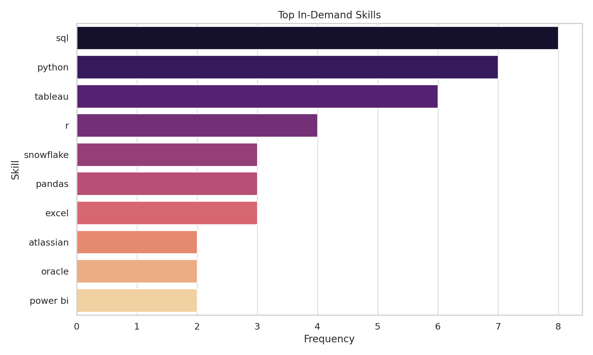

# Introduction
📊Explore the exciting world of data jobs with me. This project delves into data analyst roles, highlighting the highest-paying positions, essential skills, and the sweet spots where high demand meets excellent salaries in data analytics. Let’s discover the opportunities together.

🔍 SQL queries? Check them out here: [project_sql folder](project_sql)

# Background
To succeed in the data analyst job market, I started a project to find out how to secure high-paying, in-demand jobs. I carefully analyzed the data I gathered from my SQL course. This data provided important insights about job titles, salaries, locations, and the key skills that help candidates stand out.

The data I acquired from [SQL Course](https://www.lukebarousse.com/sql) offers valuable insights into job titles, salaries, locations, and essential skills, guiding me towards my goal.

### My SQL queries aimed to answer some captivating questions:
1. What are the top-paying data analyst jobs?
2. What skills are required for these top-paying jobs?
3. What skills are most in demand for data analysts?
4. Which skills are associated with higher salaries?
5. What are the most optimal skills to learn?

# Tools I used
For my deep dive into the data analyst job market, I utilized a suite of essential tools:

- **SQL :**  Served as the core of my analysis, enabling me to extract and analyze key insights from the data.

- **PostgreSQL :** My preferred database management system, well-suited for organizing and managing job posting data.

- **Visual Studio Code :** Used for writing and running SQL queries, as well as managing database tasks efficiently.

- **Git & GitHub :** Employed for version control and sharing my SQL scripts and findings, promoting collaboration and maintaining a clear project history.

# The Analysis
Each query for this project aimed at investigating specific aspects of the data analyst job market. Here’s how I approached each question:

### 1. Top Paying Data Analyst Jobs
To identify the highest-paying roles, I filtered data analyst positions by average yearly salary and location, focusing on remote jobs. This query highlights the high paying opportunities in the field.

``` sql
SELECT 
    job_id,
    job_title,
    job_posted_date,
    salary_year_avg,
    name AS company_name
FROM job_postings_fact 
LEFT JOIN company_dim ON job_postings_fact.company_id = company_dim.company_id
WHERE
    job_location = 'Anywhere' AND 
    job_title_short = 'Data Analyst' AND
    salary_year_avg IS NOT NULL
ORDER BY 
    salary_year_avg DESC
LIMIT 10
```
### Here's the breakdown of the analysis:
#### 🏢 Top Paying Companies
 - Mantys leads with the highest pay overall.
 - Big tech and healthcare companies like Meta, Pinterest, AT&T, and UCLA Healthcare Careers are also prominent, offering salaries ranging from $217k to $336k+.

### 📈 Salary Distribution Insight
 - The salary range of the top 10 jobs spans from $184,000 to $650,000.

 - There's a large jump between the top-paying role and the rest, showing that outliers (like Mantys) significantly raise the ceiling.

### 🔍 Key Observations
 - Titles with “Director”, “Principal”, or “Senior” command the highest salaries.

 - Data Analysts with specialization (marketing, remote/hybrid) still earn impressive salaries.

 - Top roles require leadership, strategy, and often technical expertise—not just analysis.
 
 

 *Bar graph visualizing the count of skills for the top 10 paying jobs for data analysts; i used EXCEL to generate this graph from my SQL query results*


 ### 2. Skills for Top Paying Jobs
 To understand what skills are required for the top-paying jobs, I joined the job postings with the skills data, providing insights into what employers value for high-compensation roles.
 ```sql
 WITH top_paying_job AS (
        SELECT 
            job_id,
            job_title,
            salary_year_avg,
        name AS company_name
        FROM job_postings_fact 
        LEFT JOIN company_dim ON job_postings_fact.company_id = company_dim.company_id
        WHERE
            job_location = 'Anywhere' AND 
            job_title_short = 'Data Analyst' AND
            salary_year_avg IS NOT NULL
        ORDER BY salary_year_avg DESC
        LIMIT 10
)

SELECT 
    top_paying_job.*,
     skills
FROM top_paying_job
INNER JOIN skills_job_dim ON skills_job_dim.job_id = top_paying_job.job_id
INNER JOIN skills_dim ON skills_dim.skill_id = skills_job_dim.skill_id
ORDER BY salary_year_avg DESC
```
### Here's the breakdown of the most demanded skills for the top 10 highest paying data analyst jobs in 2023:
- SQL and Python are the most universally required skills in top-paying data roles with a count of 8 and 7 respectively.

- Tableau also has a high count of 6.Other skill like R, Snowflake, pandas and Excel are also valuable tools across several roles with varying count in demand.


*Bar graph visualizing the count of skills for the top 10 paying jobs for data analysts; ChatGPT generated this graph from my SQL query results*

### 3. In-Demand Skills for Data Analysts
This query helped identify the skills most frequently requested in job postings, directing focus to areas with high demand.
```sql
SELECT 
    skills,
    COUNT(skills) AS demand_count
FROM job_postings_fact
INNER JOIN skills_job_dim ON job_postings_fact.job_id = skills_job_dim.job_id
INNER JOIN skills_dim ON skills_job_dim.skill_id = skills_dim.skill_id
WHERE 
    job_title_short = 'Data Analyst' AND
    job_work_from_home = TRUE
GROUP BY skills
ORDER BY demand_count DESC
LIMIT 5
```
### Here's the breakdown of the most demanded skills for data analysts in 2023
- **SQL** and **Exce**l remain fundamental, emphasizing the need for strong foundational skills in data processing and spreadsheet manipulation.
- **Programming** and **Visualization** Tools like **Python**, **Tableau**, and **Power BI** are essential, pointing towards the increasing importance of technical skills in data storytelling and decision support.

| SKILL | DEMAND COUNT|
|--------|------------|
|SQL     | 7291       |
|Excel   | 4611       |
|Python  | 4330       |
|Tableau | 3745       |
|Power BI| 2609       |

*Table of the demand for the top 5 skills in data analyst job postings*

### 4. Skills Based on Salary
Exploring the average salaries associated with different skills revealed which skills are the highest paying.
```SQL
SELECT 
    skills,
    ROUND(AVG(salary_year_avg), 0) AS avg_salary
FROM job_postings_fact
INNER JOIN skills_job_dim ON job_postings_fact.job_id = skills_job_dim.job_id
INNER JOIN skills_dim ON skills_job_dim.skill_id = skills_dim.skill_id
WHERE 
    job_title_short = 'Data Analyst' 
    AND salary_year_avg IS NOT NULL
    AND job_work_from_home = TRUE
GROUP BY skills
ORDER BY 
    avg_salary DESC 
LIMIT 10
```
### Here's a breakdown of the results for top paying skills for Data Analysts:

- High Demand for Big Data & ML Skills: Top salaries are commanded by analysts skilled in big data technologies (PySpark, Couchbase), machine learning tools (DataRobot, Jupyter), and Python libraries (Pandas, NumPy), reflecting the industry's high valuation of data processing and predictive modeling capabilities.
- Software Development & Deployment Proficiency: Knowledge in development and deployment tools (GitLab, Kubernetes, Airflow) indicates a lucrative crossover between data analysis and engineering, with a premium on skills that facilitate automation and efficient data pipeline management.
- Cloud Computing Expertise: Familiarity with cloud and data engineering tools (Elasticsearch, Databricks, GCP) underscores the growing importance of cloud-based analytics environments, suggesting that cloud proficiency significantly boosts earning potential in data analytics.

|Skills	|Average Salary ($)|
|-------|------------------|
|pyspark|208,172           |
|bitbucket|189,155         |
|couchbase|160,515         |
|watson|160,515            |
|datarobot|155,486         |
|gitlab|154,500            |
|swift|153,750             |
|jupyter|152,777           |
|pandas|151,821            |
|elasticsearch|145,000     |

*Table of the average salary for the top 10 paying skills for data analysts*

### 5. Most Optimal Skills to Learn
Combining insights from demand and salary data, this query aimed to pinpoint skills that are both in high demand and have high salaries, offering a strategic focus for skill development.

```sql
SELECT 
    skills_dim.skill_id,
    skills_dim.skills,
    Count(skills_dim.skill_id) AS demand_count,
    ROUND(AVG(job_postings_fact.salary_year_avg), 0) AS avg_salary
FROM job_postings_fact 
INNER JOIN skills_job_dim ON job_postings_fact.job_id = skills_job_dim.job_id
INNER JOIN skills_dim ON skills_job_dim.skill_id = skills_dim.skill_id
WHERE 
    job_title_short = 'Data Analyst'
    AND salary_year_avg IS NOT NULL
    AND job_work_from_home = TRUE
GROUP BY
    skills_dim.skill_id
HAVING COUNT(skills_dim.skill_id) > 10
ORDER BY 
        avg_salary DESC,
        demand_count DESC
LIMIT 25
```

|Skill ID	|Skills|	Demand Count|	Average Salary ($)|
|-----------|------|----------------|---------------------|
8	|go	|27	|115,320
234	|confluence	|11	|114,210
97	|hadoop	|22	|113,193
80	|snowflake	|37	|112,948
74	|azure	|34	|111,225
77	|bigquery	|13	|109,654
76	|aws	|32	|108,317
4	|java	|17	|106,906
194	|ssis	|12	|106,683
233	|jira	|20	|104,918

*Table of the most optimal skills for data analyst sorted by salary*

### Here's a breakdown of the most optimal skills for Data Analysts in 2023:

- High-Demand Programming Languages: Python and R stand out for their high demand, with demand counts of 236 and 148 respectively. Despite their high demand, their average salaries are around $101,397 for Python and $100,499 for R, indicating that proficiency in these languages is highly valued but also widely available.
- Cloud Tools and Technologies: Skills in specialized technologies such as Snowflake, Azure, AWS, and BigQuery show significant demand with relatively high average salaries, pointing towards the growing importance of cloud platforms and big data technologies in data analysis.
- Business Intelligence and Visualization Tools: Tableau and Looker, with demand counts of 230 and 49 respectively, and average salaries around $99,288 and $103,795, highlight the critical role of data visualization and business intelligence in deriving actionable insights from data.
- Database Technologies: The demand for skills in traditional and NoSQL databases (Oracle, SQL Server, NoSQL) with average salaries ranging from $97,786 to $104,534, reflects the enduring need for data storage, retrieval, and management expertise.

# What I learned
Embarking on this project helped improve my SQL knowledge:

- **🗂️ Order of Execution**: I learned the sequence in which SQL commands should be written before execution.
- **🔄 CASE Statement**: This is used to apply conditional logic to my SQL queries to obtain specific results.
- 💡 **Analytic Reasoning**: I improved my ability to translate questions and tasks into SQL queries.
- **🔗 Types of JOINs**: I mostly found myself using "LEFT JOIN" and "INNER JOIN." I was able to learn how to write queries using both join methods until I became confident with them.
- **📊 Sub-Queries and CTEs**: These were challenging at first, but I eventually became comfortable with them, and they were really helpful in my analysis.


# Conclusions
### Insights

From my analysis, I discovered some interesting insights that can really help anyone interested in a career as a data analyst:

1. **Top-Paying Data Analyst Jobs**: I found that some high-paying roles in data analytics, especially those that offer remote work, can have impressive salaries—some even reach up to $650,000!

2. **Skills for High-Paying Jobs**: One key takeaway for me was that having a strong command of SQL is crucial to landing these lucrative positions. It's definitely a skill I want to master to aim for the best salaries.

3. **Most In-Demand Skills**: I noticed that SQL is the most sought-after skill in the current data analyst job market, making it essential for job seekers like myself.

4. **Skills Linked to Higher Salaries**: Another interesting point I found is that specialized skills, such as SVN and Solidity, can lead to some of the highest average salaries, highlighting the value of niche expertise.

5. **Optimal Skills for Job Market Value**: Overall, SQL seems to be the standout skill in terms of demand and salary potential, making it a fantastic choice for anyone looking to boost their market value in the field of data analysis. I’m excited to focus on developing this skill!

### Final Reflections

Working on this project has significantly boosted my SQL skills and given me a deeper understanding of the data analyst job market. The insights gathered from my analysis can help me prioritize which skills to develop and how to approach my job search more effectively. By honing in on skills that are in high demand and offer better salaries, I can improve my chances of standing out in a competitive landscape. This experience has underscored the value of ongoing learning and adapting to the latest trends in data analytics.
